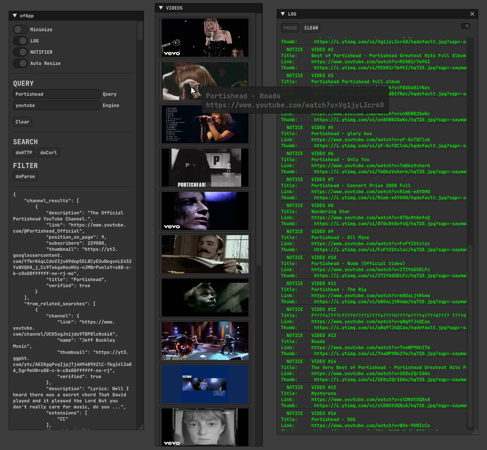

# ofxSerpAPI

A **WIP** openFrameworks addon to search/scrap responses using the [SERP API](https://serpapi.com/).

## Features:
- Currently using the [YouTube API](https://serpapi.com/youtube-search-api).
- To make a **YouTube** query search and process results.
- Gets the response as listed videos with their info and creates clickable thumbs.
- Threaded but still **WIP**.

## HOW TO
- Fill query text as a **YouTube** search.
- Hit **doHTTP** button.
- Hit **doParse** button.
- Enable the **Log** to see the video list.
- Click the vide thumbs to open a video your internet browser.

## Requirements
Register a free account for [SERP](https://serpapi.com).  
Look `addons.make` for dependencies.  
